# Hidden Timber Farm Stable Management App

Created by "Financially Stable" 

Project Team Members: Tiur Mawaddah, Mark Overman, Kevin Le, Gabrielle Umbach, and Jennifer Gaumnitz
____________

The target for the Hidden Timber Farm Stable Management app is the small horse boarding operation needing a way to market to potential boarders, manage a horse and owner database, and communicate with existing clients.

- - - -
Heroku-deployed app: ADD LINK WHEN KNOWN

GitHub repository: https://github.com/MarkOverman1216/HiddenTimberFarm

Demo video: ADD LINK WHEN KNOWN
- - - -

### How You Can Get Started With This Project ###

<strong>To use the app:</strong> 

Visit the Heroku link above. 

Enter your name in the field and click "ENTER". 

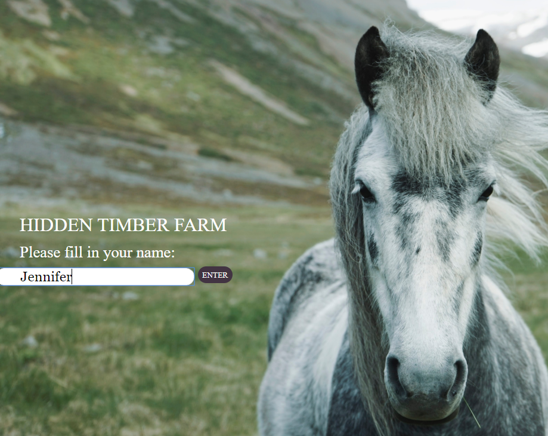

At the bottom of the welcome screen, click the down arrow to see the services and amenities of the stable (the public-facing pages that require no login). Navigate to the four pages with the dots on the far right of the screen.

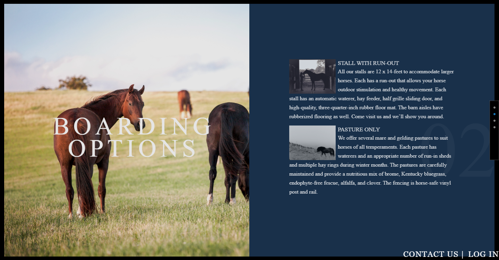

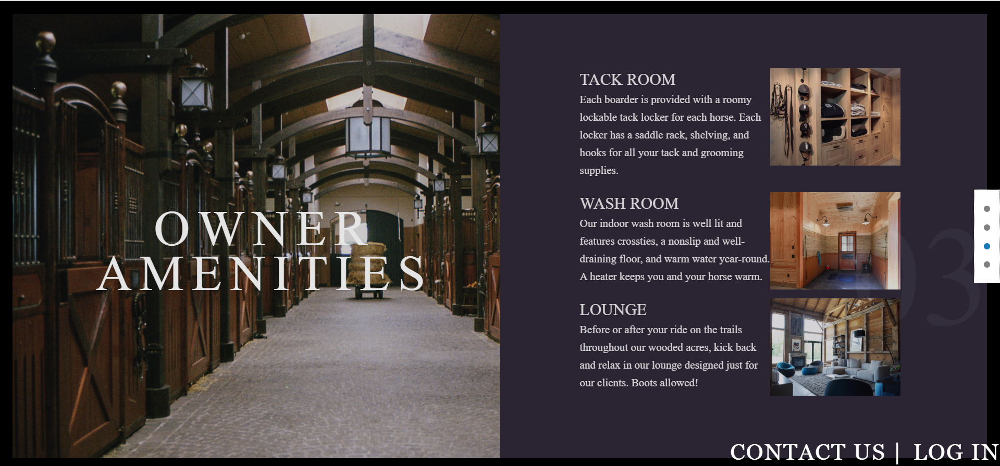

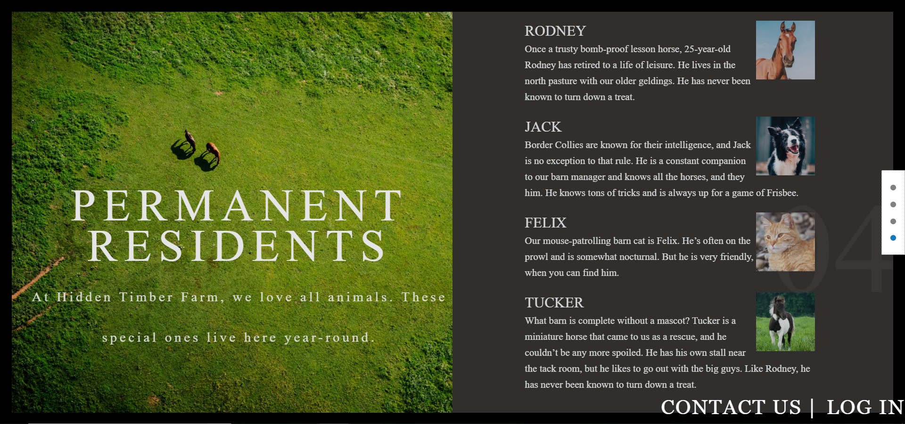

The "Contact Us" button, on the navbar at the bottom of the page, takes a user to a form that collects basic data (first and last name, phone number, email address, and a brief message). This information is emailed to the stable manager.

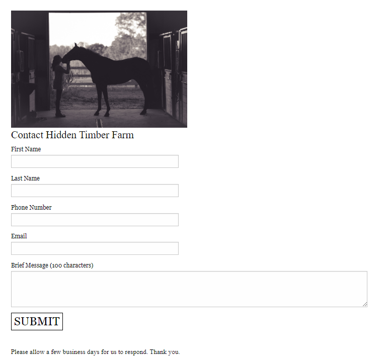

If the user clicks on the "Log In" button take a user to a login screen. ###DESCRIPTION TO COME###

###IMAGE TO COME###

<strong>If the user who logs in is a horse-owning boarding client:</strong>

 the application opens to a landing page with information about events and appointments at the stable.

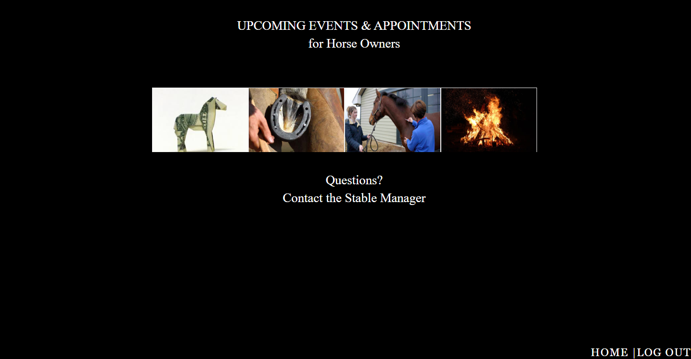

The pictures flip to reveal text about each event or appointment:

<strong>If the user who logs in is the stable manager:</strong>

the application opens to a form for entering data about horse owners.

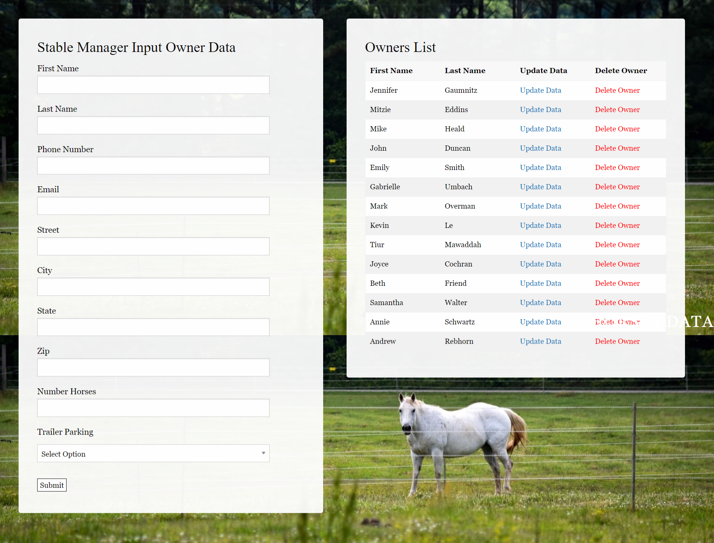

The form includes data validation, alerting the user when a field is invalid or left blank:

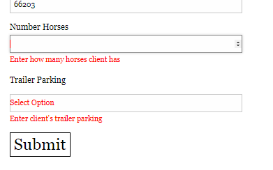

The application also has a form for entering data about horses. 

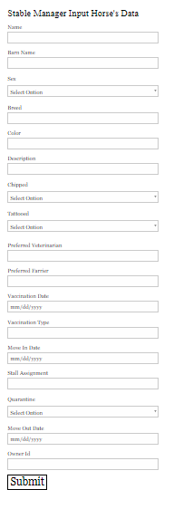

This form also includes validation.

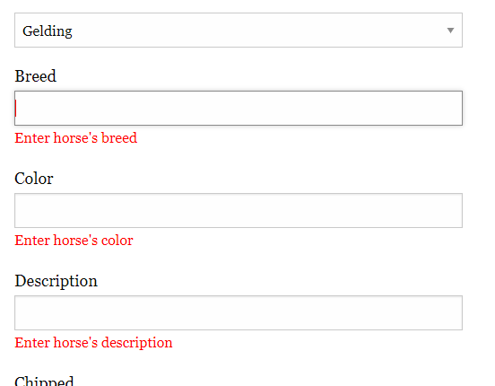

MORE INFO AND IMAGES TO COME about the database manipulation and database display.

And finally, this 404 page displays if the page the user requested is not found.

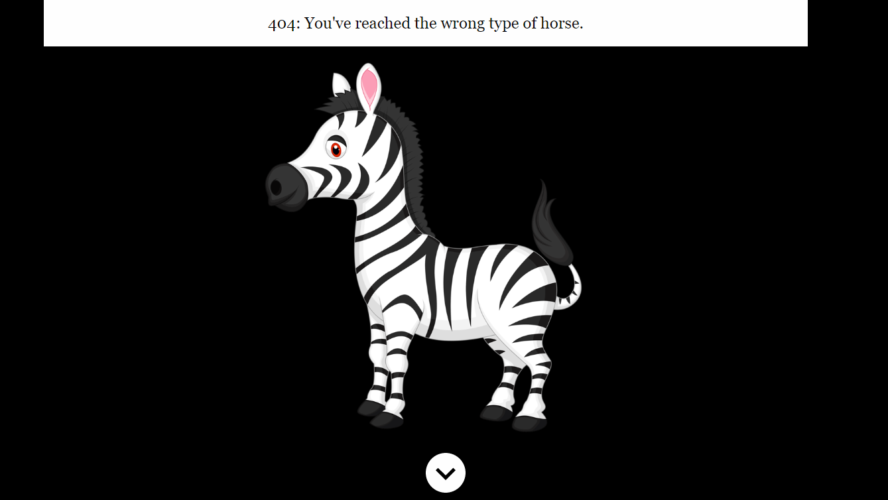

----------------------

<strong>To create the app from the files in our team's GitHub repository:</strong> 

First, clone the GitHub repository. You will need to have installed:

* Node
* And these dependencies: 
    * dotenv: 8.2.0
    * express: 4.17.1
    * express-handlebars: 3.1.0
    * mysql: 2.17.1
    * mysql2: 2.0.2,
    * nodemon: 2.0.2
    * sequelize: 5.21.3

Before running the server.js file using node.js, you will need to run "npm install." 

Then run "node server.js" at the command line to begin the server, and then navigate to localhost:3000 in your browser to see the HTML home page and proceed from there.

### Why the Project is Useful ###
There is a need for this kind of app that serves both stable managers and clients, but that is user-friendly and not cumbersome for smaller operations. This app features public-facing pages that market the amenities of the stable; a password-protected stable-manager view that allows for management of a database that contains information about clients (horse owners) and their horses; and a password-protected client view that allows existing boarders to access the stable's calendar of events

  The app also fulfilled a project assignment for University of Kansas Coding Boot Camp, August 2019 to February 2020. It provided us with the opportunity to work with the following technologies:

* HTML5
* CSS
* JavaScript
* jQuery
* Node and Express web servers
* Express Handlebars
* Foundation 6 frontend framework
* Heroku for deployment
* Sequelize
* MySql and MySql2
* MySql Workbench
* jawsDB relational database in the cloud
* Passport JS
* nodemon
* dotenv
* Favicon & App Icon Generator
* Git version-control system
* Slack messaging platform
* Survey Monkey

Dev Dependencies also included:
* eslint
* chai
* mocha
* sequelize-cli

### Who Maintains and Contributes to the Project ###

  The team members of Financially Stable (Tiur Mawaddah, Kevin Le, Mark Overman, Gabrielle Umbach, and Jennifer Gaumnitz) created the project.

### Where Users Can Get Help with This Project ###

  Questions? Contact Jennifer Gaumnitz at jlgaumnitz@gmail.com
